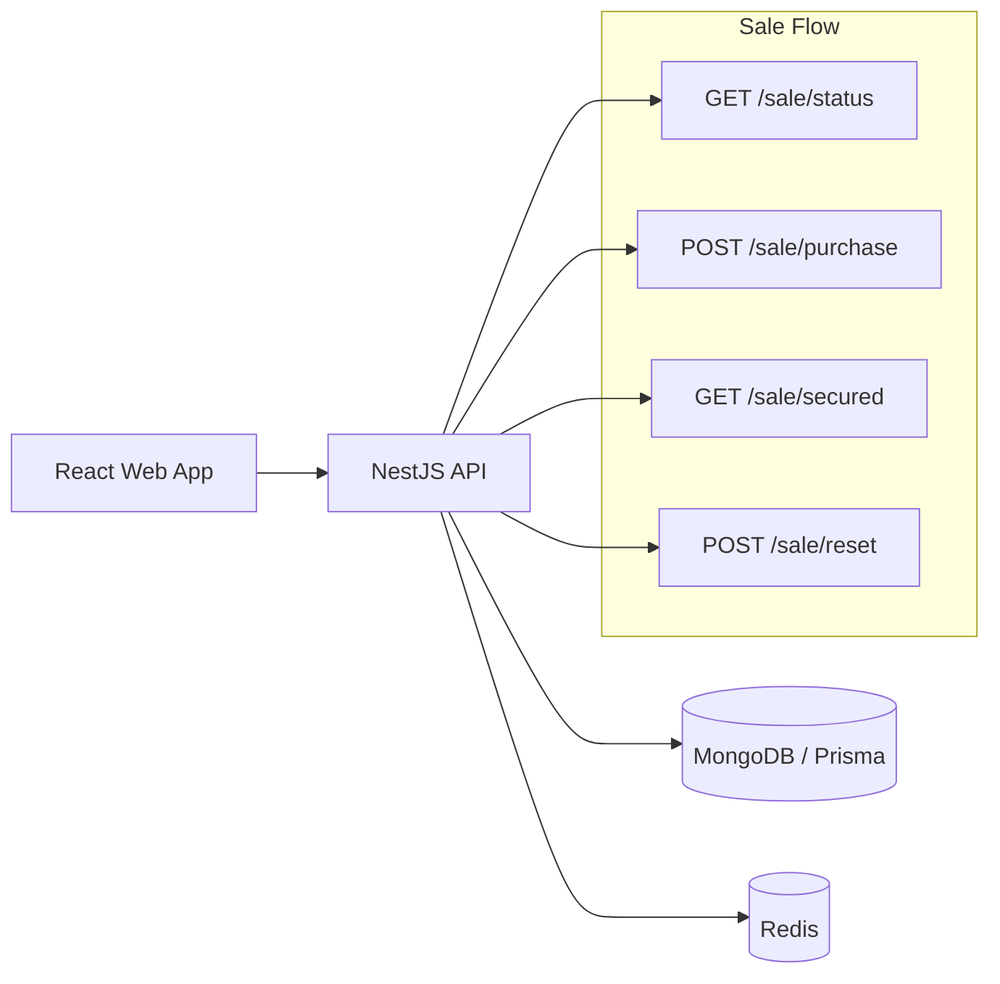
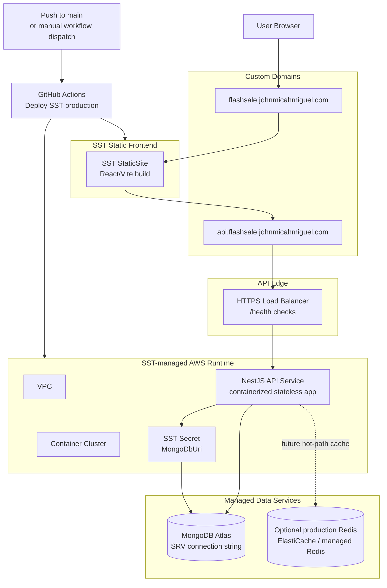

# Flash Sale Engine

A full-stack flash sale demo built for correctness under contention: one limited product, one item per user, a configurable sale window, and a simulation lab for concurrent buyer bursts.

The implementation is intentionally pragmatic. The required local path uses NestJS, React, MongoDB, and Redis. SST/AWS infrastructure is included as supplementary IaC to show how the app could be deployed, but local execution is the primary supported review path.

## What It Does

- Shows the current flash sale status: `upcoming`, `active`, `ended`, or `sold_out`.
- Accepts purchase attempts only during the configured sale window.
- Enforces limited stock.
- Enforces one item per user.
- Lets a user check whether they secured an item.
- Includes a gated Simulation Lab to reset stock/time window and fire concurrent buyer bursts.
- Includes unit, e2e, and stress-test coverage for the sale behavior.

## System Design



### Purchase Path

1. API loads the configured sale and checks the sale window.
2. Redis is used as the hot-path concurrency gate when configured:
   - atomic Lua script checks whether the user already reserved,
   - decrements stock,
   - records the buyer in a Redis set.
3. MongoDB persists the durable purchase record.
4. If Redis is unavailable or unset, the API falls back to a Mongo/Prisma transaction with guarded stock decrement.

MongoDB still stores the source-of-truth purchase records. Redis reduces hot contention during the sale window.

## Tech Stack

- Monorepo: `pnpm` workspaces + Turbo
- API: NestJS, Prisma, MongoDB, Redis
- Web: React + Vite
- Shared contracts: `packages/shared-types`
- IaC: SST v3 / AWS, included as supplementary deployment infrastructure

### Why This Stack

- **NestJS API**: keeps the business rules in a clear service/controller structure and gives DTO validation at the API boundary.
- **MongoDB Atlas + Prisma**: provides a free managed MongoDB option for review, durable purchase records, and a database-level unique constraint for `(saleId, userId)`.
- **Redis**: handles the high-contention stock reservation path with atomic operations, which is the core scaling problem in a flash sale.
- **React/Vite**: keeps the frontend lightweight while still making the behavior easy to demo.
- **Shared TypeScript contracts**: keeps API and web response shapes aligned without duplicating interfaces.
- **SST/AWS**: demonstrates an infrastructure path for a stateless API and static frontend without making cloud deployment mandatory for review.

## Local Prerequisites

- Node.js `>=24`
- pnpm `>=9`
- MongoDB Atlas SRV connection string or another MongoDB connection string
- Redis for the intended high-concurrency path

Redis can be started locally with Docker:

```bash
docker run --name flash-sale-redis -p 6379:6379 redis:7
```

## Environment Setup

For ease of review, this project is designed to work well with a free MongoDB Atlas cluster. Atlas gives a hosted MongoDB SRV connection string, avoids extra local Docker/database setup, and is close to how the app would connect to managed data infrastructure in production. Local MongoDB also works if you prefer it.

Create `apps/api/.env`:

```bash
PORT=3000
MONGODB_URI="mongodb+srv://<user>:<password>@<cluster>.mongodb.net/flash-sale"
REDIS_URL="redis://127.0.0.1:6379"
CORS_ORIGINS="http://localhost:5173"

SALE_ID="bookipi-flash-sale"
SALE_TOTAL_STOCK=100
SALE_EDITION_TOTAL=100
SALE_EDITION_NUMBER=47
SALE_CURRENCY="AUD"

SIMULATION_ENABLED=true
SIMULATION_LAB_SECRET="change-me-for-local-demo"
```

Create `apps/web/.env` or use `apps/web/.env.example`:

```bash
VITE_API_URL=http://localhost:3000
```

Do not commit real connection strings or secrets.

## Install

```bash
pnpm install
```

Generate the Prisma client:

```bash
pnpm --filter @flash-sale/api exec prisma generate
```

Seed the demo sale:

```bash
pnpm --filter @flash-sale/api exec prisma db seed
```

The seed script creates or updates the configured sale, clears old purchases for that sale, and flushes related Redis keys when `REDIS_URL` is set.

## Run Locally

Run API and web together:

```bash
pnpm dev
```

Default local URLs:

- Web: `http://localhost:5173`
- API: `http://localhost:3000`
- Health: `http://localhost:3000/health`

The web app includes a Dev Mode toggle. Enter `SIMULATION_LAB_SECRET` to show the Simulation Lab.

## API Endpoints

- `GET /health` - MongoDB and Redis health.
- `GET /sale/status` - current sale status, stock, product, and simulation counters.
- `POST /sale/purchase` - purchase attempt with `{ "userId": "..." }`.
- `GET /sale/secured?userId=...` - check whether a user secured an item.
- `POST /sale/reset` - simulation-only reset of stock and sale window.
- `POST /sale/simulation-lab/verify` - validates the Simulation Lab password.

## Tests

Run all package tests:

```bash
pnpm test
```

Run API unit tests:

```bash
pnpm --filter @flash-sale/api test
```

Run API e2e tests:

```bash
pnpm --filter @flash-sale/api test:e2e
```

Run typechecks:

```bash
pnpm typecheck
```

Coverage highlights:

- Sale business logic and edge cases.
- Redis stock/reservation behavior.
- API contract tests for status, purchase, secured check, reset, and Simulation Lab verification.

## Stress Test

For manual review, prefer the web UI Simulation Lab:

1. Run the app with `pnpm dev`.
2. Open the web app.
3. Toggle Dev Mode and enter `SIMULATION_LAB_SECRET`.
4. Reset the sale stock/window.
5. Run one of the buyer simulations and watch the live counters.

This is the easiest way to see the concurrency behavior, stock cap, duplicate-user handling, and sale-window controls in one place.

A repeatable command-line stress script is also included for automated or terminal-based runs:

```bash
API_URL=http://localhost:3000 STRESS_BUYERS=1000 STRESS_STOCK=100 pnpm stress:sale
```

Defaults:

- `API_URL=http://localhost:3000`
- `STRESS_BUYERS=1000`
- `STRESS_STOCK=100`
- `STRESS_RESET=true`

The script resets the sale, launches concurrent purchase attempts, then prints counts by outcome and an oversell check.

Expected outcome for `STRESS_BUYERS=1000` and `STRESS_STOCK=100`:

- `success` should be at most `100`.
- most remaining requests should be `sold_out`.
- `Oversold: NO`.

## Design Choices and Tradeoffs

### Redis for Hot Contention

Redis handles the fast stock reservation path with an atomic Lua script. This avoids forcing every concurrent buyer through MongoDB for the stock decision.

Tradeoff: if the API crashes after Redis reserves stock but before Mongo persists the purchase, that reservation can be stranded until reset. For a production system, I would add reservation TTLs plus reconciliation or an async finalizer. For this assessment, the simpler path keeps the implementation understandable while proving the concurrency rule.

### MongoDB for Durable Purchases

MongoDB stores purchases and sale configuration. A unique compound index on `(saleId, userId)` enforces one item per user at the database level.

MongoDB Atlas is a practical fit for this assessment because the free tier is enough for local/demo traffic, the SRV connection string is simple to share via environment variables, and reviewers do not need to run a separate MongoDB container just to exercise the app.

### Mongo Fallback

If Redis is not configured or unavailable, the purchase path falls back to a Mongo transaction that decrements stock only when stock remains. This keeps the app functional, though with less throughput than the Redis path.

### Simulation Lab

The Simulation Lab is intentionally behind a simple password gate and `SIMULATION_ENABLED=true`. It is a demo/testing surface, not an admin product.

## SST / AWS Infrastructure

`sst.config.ts` provisions:

- an AWS VPC,
- an ECS-style service for the API,
- a static site for the web app,
- custom domains and health checks,
- a secret placeholder for MongoDB URI.
- a GitHub Actions production deploy workflow via `.github/workflows/deploy.yml`.



This is a real deployable cloud path, not just a sketch. `sst.config.ts` defines the AWS resources and `.github/workflows/deploy.yml` deploys production on pushes to `main` or manual workflow dispatch. The workflow installs dependencies, installs SST providers, configures AWS credentials from GitHub secrets, and runs `pnpm sst:deploy`.

The API is packaged as a stateless container service behind a load balancer. That shape is intentional: an ECS/Fargate-style managed service can be scaled horizontally by increasing the service `max` capacity and adding autoscaling policies around CPU, memory, or request/load-balancer metrics. That helps absorb more concurrent API traffic in a production version.

Redis is the one intentional gap in the SST deployment. Local review uses Redis to demonstrate the full high-concurrency path, while the AWS stack focuses on the deployable web/API infrastructure: hosted static frontend, containerized API, load balancer, custom domains, health checks, secrets, and CI/CD. In a production hardening pass, the optional Redis node in the diagram would become ElastiCache or another managed Redis service wired into the API environment.

The current SST config keeps `scaling: { min: 1, max: 1 }` for cost and predictability in this assessment deployment. Scaling API containers improves throughput, but it does not replace the concurrency controls: shared Redis/Mongo constraints still enforce stock and one-item-per-user correctness across all instances.

Commands are present if you want to inspect the IaC flow:

```bash
pnpm sst:dev
pnpm sst:deploy
pnpm sst:remove
```

These require AWS credentials, domain/DNS ownership, and secret configuration, so they are not part of the required local review path.